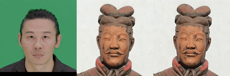

<h1 align="center">This is the modification of LivePortrait: Efficient Portrait Animation with Stitching and Retargeting Control for allowing video as a source </h1>


<br>
<div align="center">
  <!-- <a href='LICENSE'></a> -->
  <a href='https://arxiv.org/pdf/2407.03168'></a>
  <a href='https://liveportrait.github.io'></a>
  <a href ='https://github.com/KwaiVGI/LivePortrait'>Official Liveportrait</a>
</div>
<br>

<p align="center">
  
  <br>
  🔥 For more results, visit LivePortrait <a href="https://liveportrait.github.io/"><strong>homepage</strong></a> 🔥
</p>


## 🔥 Getting Started
### 1. Clone the code and prepare the environment
```bash
git clone https://github.com/KwaiVGI/LivePortrait
cd LivePortrait

# create env using conda
conda create -n LivePortrait python==3.9.18
conda activate LivePortrait
# install dependencies with pip
pip install -r requirements.txt
```

### 2. Download pretrained weights

Download the pretrained weights from HuggingFace:
```bash
# you may need to run `git lfs install` first
git clone https://huggingface.co/KwaiVGI/liveportrait pretrained_weights
```

Or, download all pretrained weights from [Google Drive](https://drive.google.com/drive/folders/1UtKgzKjFAOmZkhNK-OYT0caJ_w2XAnib) or [Baidu Yun](https://pan.baidu.com/s/1MGctWmNla_vZxDbEp2Dtzw?pwd=z5cn). We have packed all weights in one directory 😊. Unzip and place them in `./pretrained_weights` ensuring the directory structure is as follows:
```text
pretrained_weights
├── insightface
│   └── models
│       └── buffalo_l
│           ├── 2d106det.onnx
│           └── det_10g.onnx
└── liveportrait
    ├── base_models
    │   ├── appearance_feature_extractor.pth
    │   ├── motion_extractor.pth
    │   ├── spade_generator.pth
    │   └── warping_module.pth
    ├── landmark.onnx
    └── retargeting_models
        └── stitching_retargeting_module.pth
```

### 3. Inference 🚀

#### Fast hands-on
```bash
python inference.py
```

If the script runs successfully, you will get an output mp4 file named `animations/s6--d0_concat.mp4`. This file includes the following results: driving video, input image, and generated result.

<p align="center">
  
</p>

Or, you can change the input by specifying the `-s` and `-d` arguments:

```bash
python inference.py -s assets/examples/source/s9.jpg -d assets/examples/driving/d0.mp4

# disable pasting back to run faster
python inference.py -s assets/examples/source/s9.jpg -d assets/examples/driving/d0.mp4 --no_flag_pasteback

# more options to see
python inference.py -h
```

For video: you can change the input by specifying the `-sd` and `-d` arguments:

```bash
python inference.py -sd assets/examples/driving/d3.mp4 -d assets/examples/driving/d0.mp4 -vd True

# disable pasting back to run faster
python inference.py -sd assets/examples/driving/d3.mp4 -d assets/examples/driving/d0.mp4 -vd True --no_flag_pasteback

```
#### Driving video auto-cropping

📕 To use your own driving video, we **recommend**:
 - Crop it to a **1:1** aspect ratio (e.g., 512x512 or 256x256 pixels), or enable auto-cropping by `--flag_crop_driving_video`.
 - Focus on the head area, similar to the example videos.
 - Minimize shoulder movement.
 - Make sure the first frame of driving video is a frontal face with **neutral expression**.

Below is a auto-cropping case by `--flag_crop_driving_video`:
```bash
python inference.py -s assets/examples/source/s9.jpg -d assets/examples/driving/d13.mp4 --flag_crop_driving_video
```

If you find the results of auto-cropping is not well, you can modify the `--scale_crop_video`, `--vy_ratio_crop_video` options to adjust the scale and offset, or do it manually.

#### Template making
You can also use the `.pkl` file auto-generated to speed up the inference, and **protect privacy**, such as:
```bash
python inference.py -s assets/examples/source/s9.jpg -d assets/examples/driving/d5.pkl
```

**Discover more interesting results on our [Homepage](https://liveportrait.github.io)** 😊

### 4. Gradio interface 🤗

We also provide a Gradio interface for a better experience, just run by:

```bash
python app.py
```

You can specify the `--server_port`, `--share`, `--server_name` arguments to satisfy your needs!


## Acknowledgements
We would like to thank the contributors of [FOMM](https://github.com/AliaksandrSiarohin/first-order-model), [Open Facevid2vid](https://github.com/zhanglonghao1992/One-Shot_Free-View_Neural_Talking_Head_Synthesis), [SPADE](https://github.com/NVlabs/SPADE), [InsightFace](https://github.com/deepinsight/insightface), [LivePortrait](https://github.com/KwaiVGI/LivePortrait) repositories, for their open research and contributions.

## Citation 💖

```bibtex
@article{guo2024liveportrait,
  title   = {LivePortrait: Efficient Portrait Animation with Stitching and Retargeting Control},
  author  = {Guo, Jianzhu and Zhang, Dingyun and Liu, Xiaoqiang and Zhong, Zhizhou and Zhang, Yuan and Wan, Pengfei and Zhang, Di},
  journal = {arXiv preprint arXiv:2407.03168},
  year    = {2024}
}
```
